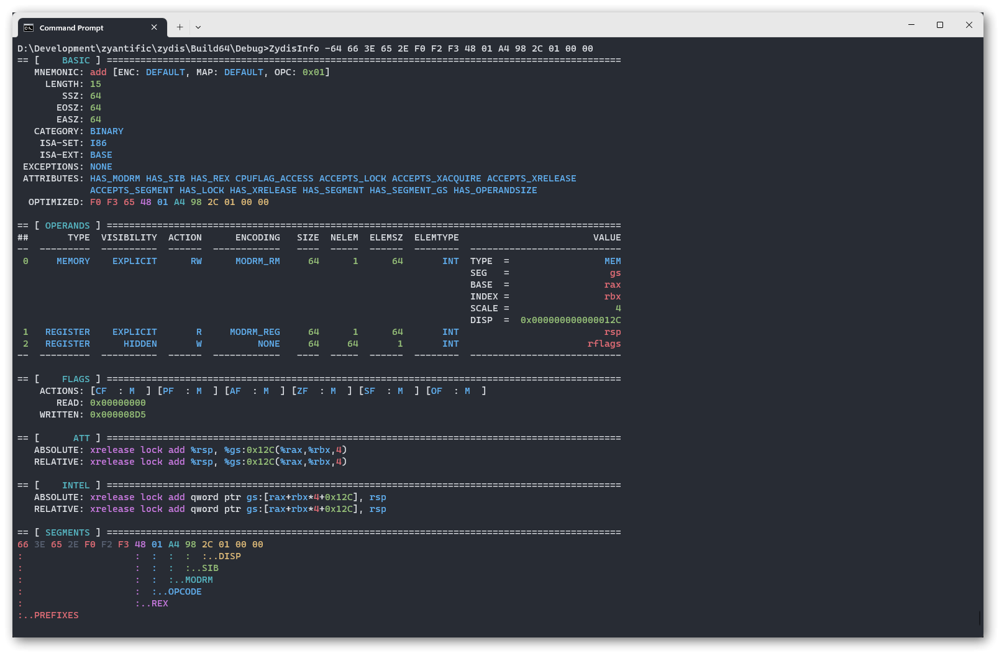

<p align="center">
  <a href="https://zydis.re/">
    <picture>
      <source media="(prefers-color-scheme: dark)" srcset="https://raw.githubusercontent.com/zyantific/zydis/master/assets/img/logo-dark.svg" width="400px">
      <source media="(prefers-color-scheme: light)" srcset="https://raw.githubusercontent.com/zyantific/zydis/master/assets/img/logo-light.svg" width="400px">
      
    </picture>
  </a>
</p>

<p align="center">
  
  <a href="https://github.com/zyantific/zydis/actions"></a>
  <a href="https://bugs.chromium.org/p/oss-fuzz/issues/list?sort=-opened&can=1&q=proj:zydis"></a>
  <a href="https://discord.zyantific.com/"></a>
</p>

<p align="center">Fast and lightweight x86/x86-64 disassembler and code generation library.</p>

## Features

- Supports all x86 and x86-64 (AMD64) instructions and [extensions](./include/Zydis/Generated/EnumISAExt.h)
- Optimized for high performance
- No dynamic memory allocation ("malloc")
- Thread-safe by design
- Very small file-size overhead compared to other common disassembler libraries
- [Complete doxygen documentation](https://doc.zydis.re/)
- Trusted by many major open-source projects
  - Examples include [x64dbg][zydis-x64dbg], [Mozilla Firefox][zydis-firefox] and [Webkit][zydis-webkit]
- Absolutely no third party dependencies — not even libc
  - Should compile on any platform with a working C11 compiler
  - Tested on Windows, macOS, FreeBSD, Linux and UEFI, both user and kernel mode

[zydis-x64dbg]: https://github.com/x64dbg/x64dbg/tree/729285ef82580812edf7167c41aa6a2c23d8d72d/src/zydis_wrapper
[zydis-firefox]: https://github.com/mozilla/gecko-dev/tree/3ddbce3c426a55080bd84974444f9ac4869e580b/js/src/zydis
[zydis-webkit]: https://github.com/WebKit/WebKit/tree/1f2d2a92eeb831bedd01bbb5b694a0e29fa9af81/Source/JavaScriptCore/disassembler/zydis

## Examples

### Disassembler

The following example program uses Zydis to disassemble a given memory buffer and prints the output to the console.

https://github.com/zyantific/zydis/blob/214536a814ba20d2e33d2a907198d1a329aac45c/examples/DisassembleSimple.c#L38-L63

The above example program generates the following output:

```asm
007FFFFFFF400000   push rcx
007FFFFFFF400001   lea eax, [rbp-0x01]
007FFFFFFF400004   push rax
007FFFFFFF400005   push qword ptr [rbp+0x0C]
007FFFFFFF400008   push qword ptr [rbp+0x08]
007FFFFFFF40000B   call [0x008000007588A5B1]
007FFFFFFF400011   test eax, eax
007FFFFFFF400013   js 0x007FFFFFFF42DB15
```

### Encoder

https://github.com/zyantific/zydis/blob/b37076e69f5aa149fde540cae43c50f15a380dfc/examples/EncodeMov.c#L39-L62

The above example program generates the following output:

```
48 C7 C0 37 13 00 00
```

### More Examples

More examples can be found in the [examples](./examples/) directory of this repository.

## Build

There are many ways to make Zydis available on your system. The following sub-sections list commonly used options.

### CMake Build

**Platforms:** Windows, macOS, Linux, BSDs

You can use CMake to build Zydis on all supported platforms. 
Instructions on how to install CMake can be found [here](https://cmake.org/install/).

```bash
git clone --recursive 'https://github.com/zyantific/zydis.git'
cd zydis
cmake -B build
cmake --build build -j4
```

### Visual Studio 2022 project

**Platforms:** Windows

We manually maintain a [Visual Studio 2022 project](./msvc/) in addition to the CMake build logic.

### CMake generated VS project

**Platforms:** Windows

CMake can be instructed to generate a Visual Studio project for pretty much any VS version. A video guide describing how to use the CMake GUI to generate such project files is available [here](https://www.youtube.com/watch?v=fywLDK1OAtQ). Don't be confused by the apparent use of macOS in the video: Windows is simply running in a virtual machine.

### Amalgamated distribution

**Platforms:** any platform with a working C11 compiler

We provide an auto-generated single header & single source file variant of Zydis. To use this variant
of Zydis in your project, all you need to do is to copy these two files into your project. The 
amalgamated builds can be found on our [release page](https://github.com/zyantific/zydis/releases)
as `zydis-amalgamated.tar.gz`.

These files are generated with the [`amalgamate.py`](./assets/amalgamate.py) script.

### Package managers

**Platforms:** Windows, macOS, Linux, FreeBSD

Pre-built headers, shared libraries and executables are available through a variety of package managers.

<details>
  <summary>Zydis version in various package repositories</summary>
  
  [](https://repology.org/project/zydis/versions)
  
</details>

| Repository | Install command                            | 
|------------|--------------------------------------------|
| Arch Linux | `pacman -S zydis`                          |
| Debian     | `apt-get install libzydis-dev zydis-tools` |
| Homebrew   | `brew install zydis`                       |
| NixOS      | `nix-shell -p zydis`                       |
| Ubuntu     | `apt-get install libzydis-dev zydis-tools` |
| vcpkg      | `vcpkg install zydis`                      |

## Using Zydis in a CMake project

An example on how to use Zydis in your own CMake based project [can be found in this repo](https://github.com/zyantific/zydis-submodule-example).

## `ZydisInfo` tool

The `ZydisInfo` command-line tool can be used to inspect essentially all information 
that Zydis provides about an instruction.



## Bindings

Official bindings exist for a selection of languages:

- [Rust](https://github.com/zyantific/zydis-rs)
- [Python 3](https://github.com/zyantific/zydis-py)

### asmjit-style C++ front-end

If you're looking for an asmjit-style assembler front-end for the encoder, check out [zasm](https://github.com/zyantific/zasm).
zasm also provides an idiomatic C++ wrapper around the decoder and formatter interface.

## Versions

### Scheme

Versions follow the [semantic versioning scheme](https://semver.org/). All stability guarantees apply to the API only. ABI stability is provided only between patch versions.

### Branches & Tags

- `master` holds the bleeding edge code of the next, unreleased Zydis version. Elevated amounts of bugs and issues must be expected, API stability is not guaranteed outside of tagged commits.
- Stable and preview versions are annotated with git tags
  - beta and other preview versions have `-beta`, `-rc`, etc. suffixes
- `maintenance/v3` points to the code of the latest release of v3
  - v3 won't get any feature updates but will receive security updates until 2025
- `maintenance/v2` points to the code of the last legacy release of v2
  - v2 is has reached end-of-life and won't receive any security updates

## Credits

- Intel (for open-sourcing [XED](https://github.com/intelxed/xed), allowing for automatic comparison of our tables against theirs, improving both)
- [LLVM](https://llvm.org) (for providing pretty solid instruction data as well)
- Christian Ludloff (https://sandpile.org, insanely helpful)
- [LekoArts](https://www.lekoarts.de/) (for creating the project logo)
- Our [contributors on GitHub](https://github.com/zyantific/zydis/graphs/contributors)

## Troubleshooting

### `-fPIC` for shared library builds

```
/usr/bin/ld: ./libfoo.a(foo.c.o): relocation R_X86_64_PC32 against symbol `bar' can not be used when making a shared object; recompile with -fPIC
```

Under some circumstances (e.g. when building Zydis as a static library using
CMake and then using Makefiles to manually link it into a shared library), CMake
might fail to detect that relocation information must be emitted. This can be forced
by passing `-DCMAKE_POSITION_INDEPENDENT_CODE=ON` to the CMake invocation.

## Consulting and Business Support

We offer consulting services and professional business support for Zydis. If you need a custom extension, require help in integrating Zydis into your product or simply want contractually guaranteed updates and turnaround times, we are happy to assist with that! Please contact us at business@zyantific.com.

## Donations

Donations are collected and distributed using [flobernd](https://github.com/users/flobernd/sponsorship)'s account.

## License

Zydis is licensed under the MIT license.
